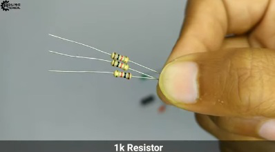

>
> This is a very interesting and easy to make project. This device will
> detect whether there is any current or not from a quite long range.

>

**Story :-**

**This is a very interesting and easy to make project. This device will
detect whether there is any current or not from a quite long range. This
project is known as \"Wireless Voltage tester\" \"Wireless Voltage
tester\"**

> By following this guide, you will be able to know and make your
> Wireless Voltage Tester This project guide contains the files necessary
> to help you step by step produce your own Wireless Voltage Tester
> Please follow the steps of the project to get a positive result.

**Step 1 :- Get your PCB ready!**

**Talking about electronics!**

> After making the circuit diagram I transformed it into a PCB design to
> produce it, to produce the PCB, I have chosen JLCPCB the best PCB
> supplier and the cheapest PCB provider to order my circuit. with the
> reliable platform, all I need to do is some simple clicks to upload
> the Gerber file and set some parameters like the PCB thickness color
> and quantity. I've paid just 2 Dollars to get my PCB after five days
> only, what I have noticed about JLCPCB this time is the
> \"out-of-charge PCB color\" which means you will pay only 2 USD for
> any PCB color you choose.

**Related Download files:-**

> I've got the same PCB design that we've made for our main board and
> all the labels and logos are there to guide me during the soldering
> steps. You can also download the Gerber file for this circuit from the
> download link below in case you want to place an order for the same
> circuit design.

> **Step 2:**

 Get all the components listed above in the images.

> **Step 3:**

 Place all the components on PCB and solder it properly.

> **Step 4:**

 Stick the PCB in custom-designed PVC sheet Box as shown in
picture below with the help of Glue gun.

> **Step 5:- Final Step**
>
>* Cover the box and place all the components of PCB on
> their respective holes or places. And at last Connect it to a 9-Volt
> battery and place it inside the box by double sided tape.
>

> **Thank you for reading this guide, hopefully**, **this guide provides
> full steps to help you to create your this guide provides full steps
> to help you to create your own.**

**If you have any questions please post them in the comment section below.**

> New users will also get some coupons while registering at JCLPCB via this blue link.

